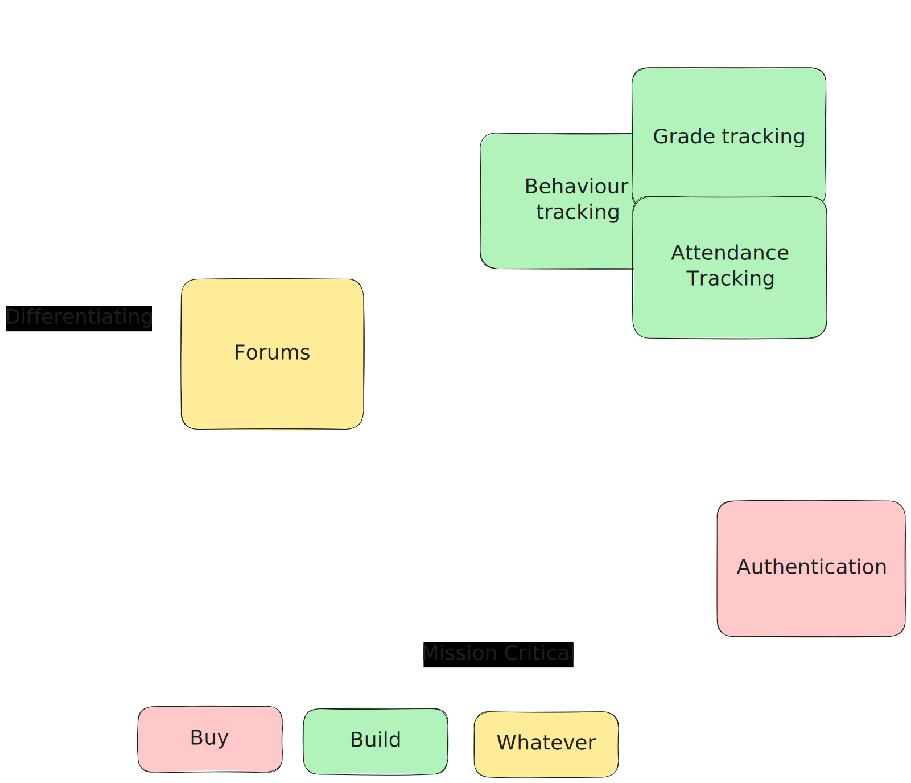
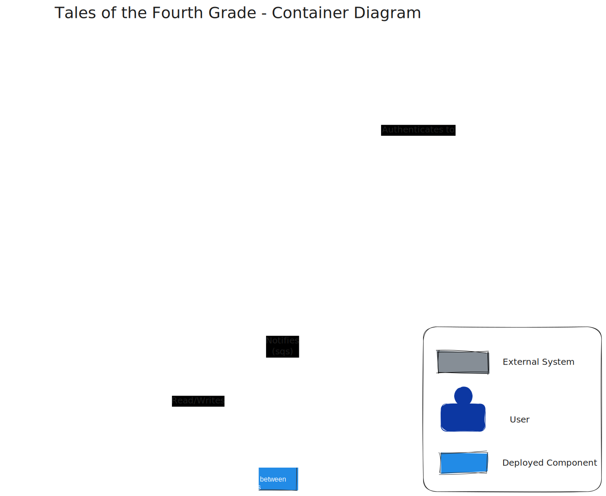
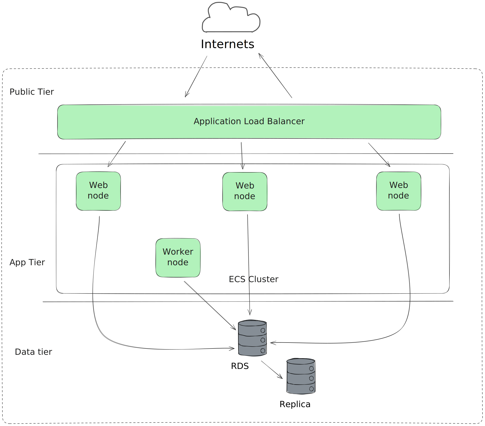
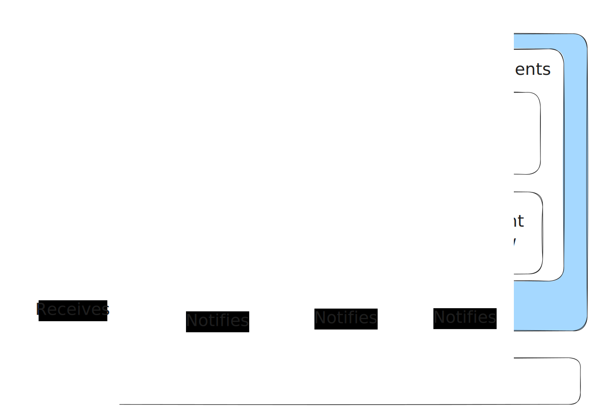

+++
title = "Tales of a Fourth Grade: An Architecture Kata"
slug = "architecture-kata-example"
date = "2024-03-30"
category = "architecture"

[extra]
author = "Bob Gregory"

[taxonomies]
tags = ["architecture", "kata"]
+++

Architecture katas are a way for us to practice our design skills. I often use them with mentees who express an interest in software design. The idea is that we are given a problem statement, and we need to propose a system design to suit. This is also great practice for a system design interview, though I've had mixed results with those in the past, and tend not to use them myself.

<!-- more -->

Your Architectural Kata is...

# Tales Of A Fourth Grade

<div class="notepaper">
<div class="content">

An elementary school system comprehensive student management system

### Requirements

* track absences, tardies and excuses (entered by parents, faculty or staff)
* generate reports on student activities
* be accessible from the playground
* track student grades and assignments (completed and due)
* parent-teacher forums
* run as an SaaS system from a hosting center

### Users

faculty, staff and student parents

</div>
</div>

[Original kata here](http://www.architecturalkatas.com/kata.html?kata=TalesOfAFourthGrade.json)

# How does this work again?

Whenever we're building a system, we need to consider:

1. The functional requirements, the things that the customer has asked the software to _do_.
2. The constraints, the things that reduce the possible solution space.
3. The architectural qualities, or -ilities, the things that the customer needs the software to _be_.

# Functional Requirements

The requirements are given, at a very very rough level, in the problem description. In the real world, you'd have some customer or expert that you could ask for more input... I hope.

Not all of your requirements are going to be equally important. I've done a rough product-alignment matrix here. On the X axis is criticality - the stuff you have to get right in order to have a working product; on the Y axis is differentiation - the stuff that makes you different from your competitors.



### Notes on product alignment

* Attendance, behaviour, and grades tracking seem really important. If those break, the app is functionally useless, and we likely want to have a better product than our competitors here. We should build this ourselves and put in the time to make it good.
* Authentication is really important, but super boring. We need to have a good story here, but it's not something we're going to boast about - it's table stakes. We should _buy_ a solid product.
* Forums seem like a terrible idea. I can imagine that they'll be a nightmare to manage, and will lead to parent-teacher cyberbullying, but hey! I'm not the customer. If the forums are down, but you can still check up on your kid, I think the app is pretty much working. Non-critical, let's outsource it.

# Constraints

There are no constraints given in the document, so I'm going to make them up.

### What to think about

I tend to think about the following:

* People: Who is building and maintaining this software? How many of them are there, and what skills do they have?
* Money: What's the budget for this? How much can we spend on hosting and buying fancy software? If this is a consulting gig, we need to turn a profit at the end.
* Time: What's the deadline? What happens if we miss that deadline?
* Knowledge: What are the unknowns? Is there complex domain knowledge that we need to understand? Do we need specific, deep technical skills, like ML or systems engineering?

### Our constraints

I'm going to assume that:

* The developers are a product company, and this is their primary product. This isn't a consultancy job, we're in this for the long term.
* Since we're starting from scratch, this is a start up. We can choose our technologies fairly freely, so long as we don't choose anything dumb and hard to hire. It's not like we're extending an existing COBOL system.
* That means we'll have a single _small_ team of motivated people.
* In a startup, time is literally money. You burn through cash until you
    * get some more funding 
    * start to turn a profit
    * go bankrupt
* There's nothing particularly complex or technically intricate that we need to know. This is a standard CRUD-ish web app.

# -Ilities

## Modifiability

Okay, the kata says that we're building a "comprehensive student management system". In the UK, where we call mainstream high schools "comprehensive schools", that's a little ambiguous, but we'll take it to mean "all-encompassing". That smells like something we're going to be changing, a lot.

There's a handful of use-cases given, which all sound fairly straightforward except for "track student grades and assignments". How do I create an assignment? How do I know when it's completed? What is a "grade"? All of that sounds like it's going to vary on a school-by-school basis. I'd want to dig here and understand that piece in particular.

## Usability

We're building this for "faculty, staff, and student parents", and there's a particular requirement that we can use it from the playground. That means we're going to want to start with a mobile-first experience. There's no point building a .Net desktop app if most of your users are going to be using smartphones. 

Schools aren't going to want to cop any flak for incompatibility with particular devices - nobody wants to be the snob school that only has an iOS app - so we're probably building a mobile-first web application. Maybe later we can gussy it up and make a progressive web app or something. Is that still a thing?

We probably don't need to think too much about an offline component. If we expected that users needed to work in a remote location for extended periods, we might want some kind of offline sync approach, but I'm guessing that most schools have wi-fi, or are at least in areas with decent mobile coverage. If you're at a school without either of those, then you're probably not our target market.

## Security

If I were evil, what could I do? Well, I could change my grades to avoid my parents from finding out that I never did my physics homework[^1]. I could steal a whole bunch of private data about children, that seems pretty bad. I could change the school's logo to a Goatse pic for lulz. The biggest risk here seems like safeguarding information: addresses, potential behavioural or health problems.

It would definitely be bad if a parent accessed information about someone else's kid, and it would be slightly less bad if a staff member accessed information about another school. We'll need some kind of authorization framework that lets us restrict access to sensitive data, and we'll want to separate those parts of the application that can change data (absences, grades etc) from those that read it.

If we have a set of endpoints that serve staff use-cases, and a set that support parent use-cases, it'll be easier for us to apply least-privilege.

I'm going to say that we should support federated identity for staff, at least, so that internal IT staff can manage on/off-boarding when someone joins or leaves a school. How exactly does a parent prove that they're the parent of a child? Most schools now collect email addressses for parents. Maybe we could just use a magic link to do parent sign-in so that we don't have to mess about with passwords and parental identity management. That'll need some kind of activation process so that we mitigate the risk of a misspelled email address leaking little Jonny's math misdemeanours.

## Testability

Nothing here is particularly out of the ordinary! Seems like a standard web application with a bunch of different modules. We should see if we can work out some way to do automated testing of accessibility requirements, and look into a browser farm to test across devices, but those things are fairly standard. There's no obviously complicated integrations, except for authentication. We probably want to build our own fake authentication service, or set up okta or something so that we can test a bunch of scenarios there.

## Availability

What happens if it goes down? Well, nobody dies, so that's always a good start. It'd be _annoying_ for our users if they can't give out behaviour points to kids, or see their child's homework, but not the end of the world. We should do the usual SaaS stuff: avoid single points of failure, load balance requests, and so on, but there's nothing too scary here.

## Performance

This one's also pretty easy. We want the app to feel snappy so that we don't make customers unhappy, but it's not like high-frequency trading, or even like e-commerce where people will go elsewhere after a 2 second delay. Our users are _captive_, so as long as the thing works, it'll likely be fine. There's no requirements given for the number of schools or the number of parents, so we'd need to dig into that. Is traffic spikey? My guess is "yes", that at the end of the school day, there'll be a deluge of parents looking to see whether their kid has been expelled yet, so if we're successfuly, we probably do want to autoscale. Maybe there'll be a small spike at the start of each hour where teachers are marking students present, but there's not _that_ many teachers as a percentage of users, so that's probably manageable.

Notably, the app is quite write-heavy. It's not like a blog where all the content can be cached. An awful lot of user interactions will be teachers adding assignments or recording behaviour.

## Observability

We want to stick some kind of observability onto each interaction that the user has, so we can see how much usage we're getting. I'm particularly concerned about cross-browser and cross-device issues, because it seems like there'll be a fairly wide spread of devices that we need to support.

# The technology stack

So with all of that said, what's the design we're going to adopt? If you know in me real life, you'll probably be surprised to hear that I'm going to propose a Django monolith.



We're going to need to build a small team, and deliver results quickly. Django makes me sad, and I wrote a whole book on how to *not* do the things that it imposes on you, but it _is_ fast to set up and iterate on. Back at [The Bad Place](https://www.cazoo.co.uk/), we built a serverless microservices architecture from day one, and it was _awesome_ but we spent a lot of time figuring out how to do things like authorization and consistent front-ends that we don't have time for here.

I'm particularly swayed by the "Parent-Teacher forums". I don't to build a forum, it's fiddly and boring, but I don't think I can just outsource schooling data to Discourse, so we're looking for either Commercial-Off-The-Shelf, or open-source. Django has a bunch of forum options that we can tweak and make our own.

If we're running Django, there's only one sane choice for persistent storage, which is Postgresql.

We're told that we need to host this as a "SaaS system from a hosting center". I'm reading that creatively, and assuming that I can run this in the cloud. If not, I'd have to think pretty carefully about the hosting infrastructure.



Nothing you haven't seen a million times. We'll deploy our Django app as a docker container to an ECS cluster behind an application loadbalancer in a VPC. We'll make sure that we span all the availability zones in that VPC so that we can tolerate failure in one AZ. For RDS, we'll run a replica so we can fail over in case of crisis.

As a parent, I've used a bunch of different school apps, and they all suck. To make this one suck less, we're going to be aggressively simple. We'll stick to server-side rendering as much as we can, and use htmx to progressively add flashier features on devices that can support it. By default, this should be a noughties era full page-refresh CRUD web app. Keeping javascript lean will help us deliver a usable experience when you're trying to report your kid's absence on a packed commuter train.

## Design considerations

Although we're going into this with a simple stack, we're going to ensure that we build a _modular_ monolith. I am not a Django fan, and want the option to migrate parts of our system away if we start to get problems.

That means we're going to be _picky_ about the way we structure our database. I'm minded to try out Django's support for applications to make this work. We'll divide the functionality into rough chunks that could, eventually, becomes standalone systems.



These chunks can communicate asynchronously. Since we've decided on AWS, we'll use SQS as a message broker, because it's cheap and robust. I _could_ use celery here, but its message format is awful - it's an RPC protocol disguised as an asynchronous worker system. We'll mark that as an open question.

This set up gives us a compromise: we're going to use a rapid application development framework, we're going to avoid coupling things too much so that we can rewrite components later if we need to, and we're going to invest in messaging early on. That should give us a solid base to get started with plenty of optionality for the future.

Authorization feels like a pain point. Our faculty and staff will likely want to have single sign-on so that users can be removed by IT staff through federation with existing systems. That's awkward to build and maintain, which would generally push me to a third party solution like Okta, but most of our users will be _parents_ who aren't paying customers. Okta, at $2/user-month is going to eat into our profits. We likely need a hybrid solution: support OIDC for staff, and use a magic-link authentication system for parents. Cognito probably fits our bill as a cheap way to provide OIDC for parents so that the authentication schemes are the same.

We'll need to put in some work on an authorization system that restricts endpoint access based on roles, and the specific school that a user has access to. We can probably hack together something with decorators, eg.

```python
@student
@staff
def get_behaviour_log(student_id: int) -> BehaviourLog:
    ...
    
@staff
def record_behaviour_incident(student_id, note: str, event: BehaviourEvent) -> None:
    ...
```

# Checking our design

## Modifiability

This feels like a tick. It will be quick and easy for us to prototype new features with Django. We can use open-source components for non-differentiating stuff like the forums. We can rewrite components entirely if we like, replacing a Django app with a serverless Rust microservice or some nonsense, but we're starting with simplicity.

## Usability

Tick with caveats. By adopting an old-school web app architecture, we should get wide compatability with mobile browsers, and better loading times than some gigantic React nightmare.

At some point it would be _nice_ to support push notifications so that, if your daughter doesn't show up to school, or stabs her friend with a compass, you get pinged, and that's harder without a native app.

## Security

We have some open questions about the right way to authenticate our users, and would need to look at the available toolsets. Mozilla have a [mature OIDC implementation](https://mozilla-django-oidc.readthedocs.io/en/stable/index.html) that's worth a spike.

We'll need to do some spikes on the authorization model to make sure that we can lock down resources by role, school, and student. This would be an area where I'd spend time to build a solid test suite.

## Testability

No major caveats here. Django _does_ have good test support, though it relies heavily on an actual database which makes me sad.

The permissions system will make things fiddly to test without complicated test setup. We might consider adding a "test mode" where we can fake out the authorization to test different scenarios.

## Availability

We've avoided any single points of failure here. Our worst case scenario is Amazon losing an entire region, which _could_ happen, or - more likely - we do something stupid and the database falls over, at which point we fail over to the replica.

## Performance

We don't have any critical requirements here, other than "don't suck". The Django ORM can be a bit of a pain to tune, but we're deliberately avoiding the kind of tangled domain model that makes it difficult to optimise, so this should give us plenty of performance for the first few dozen schools.

## Observability

Unsurprisingly, I'm going to plump for Honeycomb here. $130/month gets us 100M events, which is way more than we should need for the foreseeable future. We can instrument each Django endpoint and each async task, and that should give us useful insights into what's happening on the backend. For the front-end, as we start to add richer functionality, we'll need to figure out how to instrument the client-side. That's trickier, but it's also a job for another iteration.

# Wrap up

So there we have it - a design for a comprehensive student management system, cranked out in a couple of hours. I'm not totall happy with it, there are some lurking unknowns over Authentication, and I never really thought about the forums or grading problems, but it'll do as a first pass.

### Things to note

The constraints are super important here. I'm assuming that I can use whatever technology stack I want, but maybe this company already has 500 Java developers. Django is not going to be the right choice.

The diagrams and decisions are _deliberately_ low res. This won't be correct, we'll make mistakes and change things later. What's important is to get a direction of travel. You need to form a design that you can convince engineers to buy into.

This design would _probably_ be good enough to convince a group of engineers that you know what you're talking about, and get a product off the ground.

Using a structured process this way helps us get to that first pass quickly, and reduces the risk of missing something super obvious.

<div class="notepaper">
<div class="content">

[^1]: I would like to apologise to my physics teacher, Mr Boler. My dad ended up on a first-aid course with him and discovered that I hadn't done any homework for 6 months. He needed this app.

</div></div>

