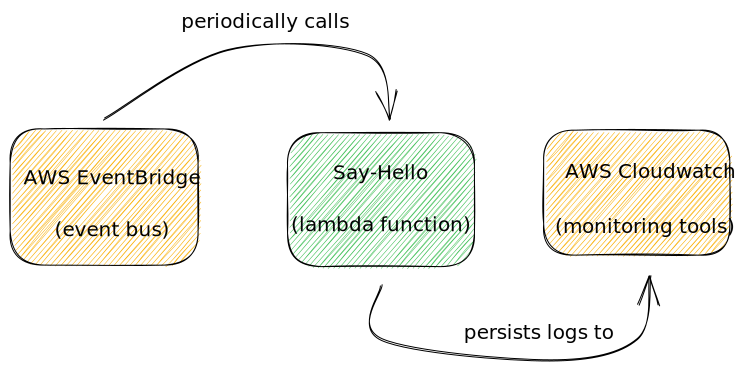
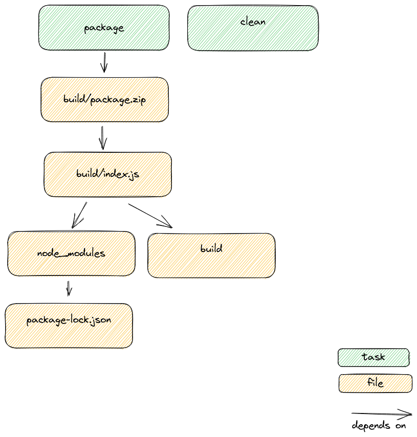

+++
title = "Deploying Lambda with ESBuild and Terraform"
slug = "deploying-Lambda-with-esbuild-and-Terraform"
date = "2022-03-10"
category = "serverless"

[extra]
author = "Bob Gregory"

[taxonomies]
tags = ["serverless", "typescript", "Terraform"]
+++

Generally when deploying Lambda functions, I use the [Serverless Framework](https://www.serverless.com). This is a wrapper around AWS Cloudformation that makes it easier for engineers to author and deploy code. It's much easier to get started when using an abstraction like this, but sometimes we need to drop down and work at a lower-level. 

I recently needed to deploy a Lambda function with a large number of triggers, and the Cloudformation template generated by the serverless framework was too large to deploy. Instead I ended up configuring everything in plain Terraform. There are more moving pieces to understand, but in return for that overhead, we gain a lot of flexibility. In this post I want to show you how to configure and deploy a simple Lambda function, configuring everything ourselves in Terraform so we can see how it all fits together.

<!-- more -->
<!-- toc -->

## What are we going to create?

We're going to build a simple Lambda function called "say-hello" that runs on a schedule, and writes a log line every minute. This is about as simple as we can make an example, but there's still a lot of concepts to cover and plenty to configure. 



## Starting with the handler

(git commit: [d669ab](https://github.com/bobthemighty/esbuild-Terraform-Lambda/commit/d669ab043a92278245d947ef45567ad4f96441bc))

The first thing we need to do is to build our Lambda handler.

```typescript
import { EventBridgeHandler } from "aws-lambda";

// type representing the empty object {}
type Empty = Record<string, never>;

// Our handler will take an empty scheduled event and return nothing
type HandlerType = EventBridgeHandler<"Scheduled Event", Empty, void>

// Date Time formatter to give us friendly output
const formatter = new Intl.DateTimeFormat("default", {
  hour: 'numeric', minute: 'numeric',
  timeZoneName: 'short'
})

// This is the code we'll run whenever our Lambda function fires
const handler: HandlerType = async () => {
    console.log(`Hello world. The time is now ${formatter.format(new Date())}`)
};

export { handler };
```

This gives us a function `handler` that will write a string like "Hello world. The time is now 8:36 PM UTC" to the console.

## Packaging the handler

To deploy our Lambda function, we'll need to compile our Typescript into plain Javascript, bundle it up and turn it into a zip file. We're using esbuild, a fast JS and Typescript bundler written in Go. Creating our bundle is a single shell command.

```bash
 esbuild \
    --bundle src/handler.ts \
    --target=node14 \
    --format=cjs \
    --external:aws-sdk \
    --outfile=build/index.js`
```

Line by line, we want to bundle the handler, targeting Node 14 (the latest supported version for Lambda), into a commonjs module. We won't bundle the AWS-SDK because that would make our code larger, and it's already available in the Lambda runtime. We'll output our bundle to the file `index.js`.

## Writing a makefile

(git commit: [26954e](https://github.com/bobthemighty/esbuild-Terraform-Lambda/commit/26954e65c7036223a3abfcc5c3eb8f4a1abdeb12))

I'm old and stuck in my ways, so I like to use Makefiles to organise my builds.

Our Makefile is super simple. 

```makefile
# ESBuild + Terraform Lambda

# Declare some vars so we don't have to repeat these strings everywhere

BUILD_DIR=build
BUNDLE_NAME=index.js
PACKAGE_NAME=package.zip

# This line says that "package" and "clean" are tasks to run, not files to create.
# Read more at https://stackoverflow.com/questions/2145590

.PHONY: package clean

# package is an empty task that _depends_ on the file build/package.zip
# In other words, the task can't run until that file exists.
# Because the task is empty, it won't do anything, so this is just a way to
# force us to generate our file.

package: ${BUILD_DIR}/${PACKAGE_NAME}

# The clean task deletes the `build` directory and `node_modules`
# It doesn't depend on anything

clean:
	rm -rf node_modules ${BUILD_DIR}

# To create the file "build/package.zip" we need to run the
# commands `cd build && zip package.zip index.js`
# But we depend on the file build/index.js

${BUILD_DIR}/${PACKAGE_NAME}: ${BUILD_DIR}/${BUNDLE_NAME}
	(cd ${BUILD_DIR} && zip ${PACKAGE_NAME} ${BUNDLE_NAME})

# To create the file build/index.js we run our ESBuild command from above
# But we depend on the "build" directory, and the "node_modules" directory
${BUILD_DIR}/${BUNDLE_NAME}: ${BUILD_DIR} node_modules
	npx esbuild --bundle src/handler.ts --format=cjs --target=node14 --outfile=${BUILD_DIR}/${BUNDLE_NAME}

# To create the build directory, we just run mkdir
${BUILD_DIR}:
	mkdir -p ${BUILD_DIR}

# And to create the node_modules directory we run npm ci
# We depend on package-lock.json. This means that whenever
# our lock file changes, the next call to `make`
# will run `npm ci`.
node_modules: package-lock.json
	npm ci
```

We can show the dependencies between the files and tasks in our makefile in a simple diagram.



Expressing our dependencies this way means we can check out the repository on any \*nix machine, run the `make` command and get a working bundle.

```shell
bob@bobs-spangly-carbon ~/c/p/esbuild> make
mkdir -p build
npm ci

added 316 packages, and audited 317 packages in 5s

31 packages are looking for funding
  run `npm fund` for details

npx esbuild --bundle src/handler.ts --format=cjs --target=node14 --outfile=build/index.js

  build/index.js  1.1kb

⚡ Done in 2ms
(cd build && zip package.zip index.js)
  adding: index.js (deflated 54%)
```


In this example app we only have a single Lambda handler. If we had multiple handlers, we'd want to call the `esbuild` command for each handler, resulting in a separate bundle for each function we want to deploy. We could easily handle that in our Makefile by adding a list of dependencies, one per handler, with a [pattern rule](https://swcarpentry.github.io/swc-releases/2016.06/make-novice/05-patterns/).


## Deploying our Lambda function

(git commit: [d0d67](https://github.com/bobthemighty/esbuild-terraform-Lambda/commit/d0d67cbdc7463257679da25a504e7a29e3dab6d2))

We've created a zip file containing our Lambda file, but we need to deploy it to AWS so we can run it with Lambda. We're going to use Terraform to manage the deployments for us. The important thing to remember is that in AWS _everything is forbidden by default_. Most of the remaining work is configuring permissions to allow Amazon to use our code. 

### Setting up Terraform

I'm keeping my Terraform scripts in the "/infra" directory of the project. The first thing to add is a new file, main.tf that configures Terraform to talk to AWS.

```
terraform {
 required_providers {
   aws = {
     source = "hashicorp/aws"
   }
 }
}

provider "aws" {
  region = "eu-west-1"
}
```

For our hobbyist use-case this is all I need. In a production codebase, you almost certainly want to use [Terraform's remote state](https://skundunotes.com/2021/03/12/Terraform-remote-state-part-1-using-aws/). This will make it possible for multiple engineers to work on the project, but requires an S3 Bucket and a Dynamo table that I don't have to set up for our purposes.

To manage Terraform versions, I use [`tfenv`](https://github.com/tfutils/tfenv). This lets me switch between versions of Terraform when I change projects.

```shell
bob@bobs-spangly-carbon ~/c/p/esbuild2> tfenv use 1.1.7
Switching default version to v1.1.7
Switching completed
```

### Creating the Lambda resource and execution role

With Terraform set up, we can write the script to manage our Lambda function.

```Terraform
resource aws_lambda_function lambda {
  filename      = var.package_filename
  function_name = var.Lambda_function_name
  role          = aws_iam_role.iam_for_lambda.arn
  handler       = var.lambda_handler

  runtime = "nodejs14.x"

  tags = {
    project = var.project_name
  }
}
```

We use Terraform's [`aws_lambda_function`](https://registry.Terraform.io/providers/hashicorp/aws/latest/docs/resources/Lambda_function) resource setting up some variables for the filename, function name etc. I'm declaring and settings defaults for these variables in `variables.tf`.

Notice on line 4, we have to provide an ARN (a unique identifier) for a role. This is the set of permissions that our Lambda function will have when it executes. We need to define that role in our Terraform script, too.

```Terraform
data aws_iam_policy_document assumption_policy {
  statement {
    sid = "assumeRole"

    actions = [
      "sts:AssumeRole"
    ]

    principals {
      type        = "Service"
      identifiers = ["Lambda.amazonaws.com"]
    }
  }
}

resource aws_iam_role iam_for_Lambda {
  name = "${var.lambda_function_name}-executor"
  assume_role_policy = data.aws_iam_policy_document.assumption_policy.json
}
```

Stepping through this, we create a new "Policy Document" that defines a set of permissions. The only permission we grant is the "AssumeRole" permission, which we grant to the AWS Lambda service. This allows AWS Lambda to create new sessions that use our role. Without this permission, AWS Lambda is _forbidden_ to run code with this role.

Our policy doesn't grant any other permissions, so our Lambda function won't have the rights to call any other AWS service. That's okay for now, because we only need to call console.log.

Lastly, we create a new IAM role and we attach our policy document to it to control role assumption.

With our scripts configured, we can add a new task to our Makefile

```makefile
deploy: package
		terraform apply \
        -chdir=infra \
		-var package_filename=${PACKAGE}
```

Now we can jump to our terminal and type `make deploy`. Terraform will spin up, and figure out a plan to deploy our function. When prompted, type we type yes to deploy our function.

```
bob@bobs-spangly-carbon ~/c/p/esbuild2 > make deploy
terraform -chdir=infra \
	apply -var package_filename=/home/bob/code/play/esbuild2/build/package.zip

terraform used the selected providers to generate the following execution plan. Resource actions are
indicated with the following symbols:
  + create

Terraform will perform the following actions:

  # aws_iam_role.iam_for_Lambda will be created
  + resource "aws_iam_role" "iam_for_lambda" {
    ... snip 
    }

  # aws_lambda_function.Lambda will be created
  + resource "aws_Lambda_function" "lambda" {
    ... snip
  }

Plan: 2 to add, 0 to change, 0 to destroy.

Do you want to perform these actions?
  Terraform will perform the actions described above.
  Only 'yes' will be accepted to approve.

  Enter a value: yes

aws_iam_role.iam_for_lambda: Creating...
aws_iam_role.iam_for_lambda: Creation complete after 1s [id=say-hello-executor]
aws_Lambda_function.lambda: Creating...
aws_Lambda_function.lambda: Still creating... [10s elapsed]
aws_Lambda_function.lambda: Creation complete after 14s [id=say-hello]

Apply complete! Resources: 2 added, 0 changed, 0 destroyed.
```

Woop!

### Testing in the console

We've deployed a function, but we haven't configured anything to invoke it. As a result, the only way to make our function run is the old fashioned way: log in to a website and click a button.

After navigating to our function in the AWS console, we can create a test event and use it to invoke our function. Success!

There's a problem, though - our function doesn't write any logs to Cloudwatch. Although we can see the log output when we run the code ourseles, it isn't persistently available. That's because _logging is forbidden by default_. Before our function can create logs in Cloudwatch, we'll need to grant it access. 

Back to Terraform!

## Adding the cloudwatch policy

(git commit: [a17ac3](https://github.com/bobthemighty/esbuild-terraform-Lambda/commit/a17ac379f57f570906d72b9342bbca7532e22195))

We need to add a new policy to our Lambda role that allows it to create Log Groups and write log events. We'll start with the policy document.

```Terraform
data aws_iam_policy_document cloudwatch_logs {
  statement {
    sid = "createLogGroup"

    actions = [
      "logs:CreateLogGroup",
      "logs:CreateLogStream",
      "logs:PutLogEvents"
    ]

    resources = [local.log_group_arn]

  }
}
```

This policy allows three actions, "CreateLogGroup" "CreateLogStream", and "PutLogEvents" on a single resource which is identified by an ARN.

All Lambda functions try to write to a log group with the name `/aws/Lambda/$NAME_OF_FUNCTION`. Each instance of our Lambda function will create a new stream in that group, and write log events to it until the it's terminated. The ARN for a log group is a painfully ugly string that includes the name, the account ID, and the region. I'm generating mine as a local variable.

```Terraform
locals {
  log_group_arn = "arn:aws:logs:${data.aws_region.current.name}:${data.aws_caller_identity.current.account_id}:log-group:/aws/Lambda/${var.Lambda_function_name}:*"
}
```

This local variable results in a string like "arn:aws:logs:eu-west-1:1234567890:log-group:/aws/Lambda/say-hello:*" which uniquely identifies the log group for our say-hello function.

We add our new policy to the existing Lambda role:

```Terraform
resource aws_iam_role iam_for_Lambda {
  name = "${var.Lambda_function_name}-executor"
  assume_role_policy = data.aws_iam_policy_document.assumption_policy.json

  inline_policy {
    name   = "allow-cloudwatch-logs"
    policy = data.aws_iam_policy_document.cloudwatch_logs.json
  }
}
```

Now we can `make deploy again`. This time, Terraform tells us that it's going to update our existing Lambda role to add the new policy.

```shell
 # aws_iam_role.iam_for_Lambda will be updated in-place
  ~ resource "aws_iam_role" "iam_for_Lambda" {
        id                    = "say-hello-executor"
        name                  = "say-hello-executor"
        tags                  = {}
        # (9 unchanged attributes hidden)

      - inline_policy {}
      + inline_policy {
          + name   = "allow-cloudwatch-logs"
          + policy = jsonencode(
                {
                  + Statement = [
                      + {
                          + Action   = [
                              + "logs:PutLogEvents",
                              + "logs:CreateLogStream",
                              + "logs:CreateLogGroup",
                            ]
                          + Effect   = "Allow"
                          + Resource = "arn:aws:logs:eu-west-1:01234567890:log-group:/aws/Lambda/say-hello:*"
                          + Sid      = "createLogGroup"
                        },
                    ]
                  + Version   = "2012-10-17"
                }
            )
        }
      + inline_policy {}
    }
```

Back in the AWS console, now when we test our function, we get persistent logs in Cloudwatch.

## Configuring the eventbridge trigger

(git commit [e52e8](https://github.com/bobthemighty/esbuild-terraform-Lambda/commit/e52e8e5cfc5abec895457673df718d160defa255))

We're nearly there! We've bundled our code, deployed a function, and granted it permission to write logs to Cloudwatch. We allowed Amazon to invoke our function when we click a button in the console.

The last thing we want to do is add our scheduled trigger. EventBridge scheduled triggers are like Cron for the cloud. In our case, we want to call our function every minute.

```Terraform
resource "aws_cloudwatch_event_rule" "every_minute" {
  name = "${var.Lambda_function_name}-every-minute"
  schedule_expression = "rate(1 minute)"
}
```

This sets ups a new event rule named `say-hello-every-minute`. Our rule is scheduled to occur every 1 minute.

```Terraform
resource "aws_cloudwatch_event_target" "invoke_Lambda" {
  rule      = aws_cloudwatch_event_rule.every_minute.name
  arn       = aws_Lambda_function.Lambda.arn
}

```

We attach a _target_ to our rule. This tells EventBridge "whenever the rule say-hello-every-minute fires, invoke this Lambda function".

Lastly, of course, we need to grant permission for EventBridge to call our function because _Eventbridge is forbidden to invoke our function by default._

```
resource "aws_Lambda_permission" "allow_cloudwatch" {
  statement_id  = "AllowExecutionFromCloudWatch"
  action        = "Lambda:InvokeFunction"
  function_name = var.Lambda_function_name
  principal     = "events.amazonaws.com"
  source_arn    = aws_cloudwatch_event_rule.every_minute.arn
}
```

This uses the `aws_Lambda_permission` resource and permits our target to invoke our function.

With that done, we jump back to our terminal and make deploy. After a few minutes, we should see our scheduled invocations in the logs.


# Summary

We covered a lot of ground here. To deploy our function we needed:

* A build process that results in a zip file
* A Terraform resource for the aws_Lambda_function
* A Terraform resource for the IAM role our function will use when running
* A role assumption policy that permits AWS Lambda to assume that role
* A Cloudwatch policy that permits our function to write logs
* A Lambda trigger that will invoke our function
* A Lambda permission that allows the trigger to invoke our function

This is a lot to keep straight, which is why I'd generally avoid using Terraform as the deployment tool for a complex codebase. For simple systems, though, or for when you absolutely need fine-grained control, it's useful to know how to deploy this way. If nothing else, understanding each piece in isolation will help you when troubleshooting higher level frameworks like Serverless or SAM.
