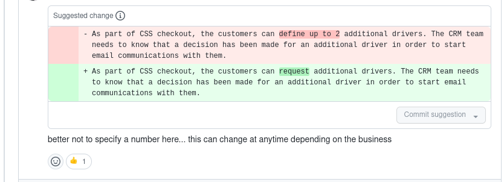
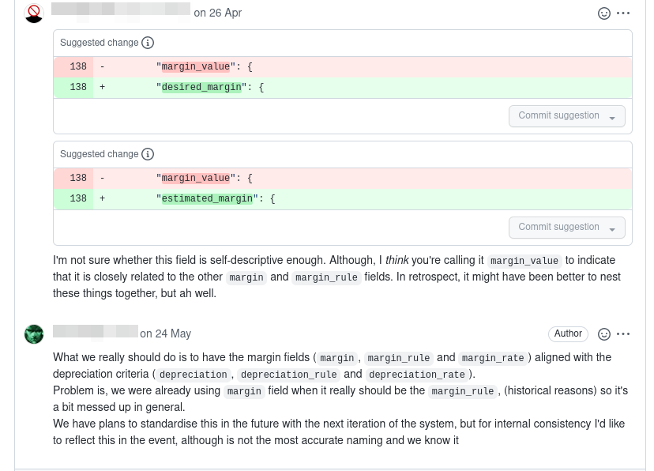

+++
title = "Getting Started With Documentation Driven Development"
slug = "documentation-driven-development"
date = "2022-06-10"
category = "event-driven"

[extra]
author = "Bob Gregory"

[taxonomies]
tags = ["architecture", "practices", "design"]
+++

Chances are that if you're building software in 2022, you're building some kind of distributed system. The success of a distributed system depends on the careful design of the interfaces between parts. For about a decade, I've been using what I call "Documentation Driven Development" (the other DDD). You can sum this up in one sentence: write the documentation first. 

<!-- more -->

Generally, whether I'm building an HTTP API or some kind of event-driven architecture, I'll require that engineers write documentation for their endpoints or messages before they start development. Once we've written documentation, we'll open a pull request, and request input from the team or stakeholders who will actually use the endpoint or event.



Using pull requests for this keeps the workflow familiar, and means we don't need fancy custom tooling. Engineers can author docs in the editor of their choice, and track them in git alongside their code. Usually, clients are happy with the first draft, but they might raise questions or concerns.

> Why is mileage a plain number here? Shouldn't we use an object with the number and the unit? How will we adapt this schema to Europe?

> I like the basic design, but I think the line items are too complex. Could we try something like this other event?

> There's already a pattern for capturing the make and model of a vehicle. Could you use that one so that it's consistent across all the events?

When all the parties are happy with the draft of a schema or API design, we merge it. We can now use the schema to drive the design of our code: consumers can start to write a client for the design, and producers can work on providing the functionality. If a new consumer wants to start using a contract, they'll find documentation ready and waiting.

If we later want to change a contract, again we open a pull request to change the existing documentation. Git makes it easy for us to look back at the commit history and see how an event has changed over time.



This is akin to TDD, in that we want to specify the behaviour of our system before it exists, but different in terms of timelines. 

For events specifically, I've tended to use markdown to describe contracts. Markdown has the advantage of being near-universal, easy to read in a text editor or on Github, and has enough structure that we can parse it to extract data. Here's what that might look like:

```markdown
---
name: PonyJumped
publisher: JumpObserver
---

# Pony Jumped

Records a pony's jump. Raised when jump-observing equipment identifies 
a landed jump.

If the pony hasn't landed after 30 seconds, we'll raise a PonyJumped 
event with no `distance` field, assuming the pony to have jumped clear 
of the local gravity field.
```

The first part of our markdown document just names and describes the event. I've used YAML to add machine-readable attributes here. The description is intended to give consumers just enough information to understand what scenarios lead to this event.

```markdown
## Schema

```json
{
    "title": "Pony Jumped",
    "type": "object",
    "required": [
        "name",
        "timestamp"
    ],
    "properties": {
        "name": {
        "type": "string",
        "description": "name of the jumping pony"
        },
        "timestamp": {
        "type": "number",
        "description": "Timestamp as number of seconds since Unix epoch"
        },
        "distance": {
        "type": "number",
        "description": "distance jumped in centimetres as an integer"
    }
}
```

Next comes the schema. I tend to use [JSON schema](https://json-schema.org/) to describe the shape of events.  Adding descriptions to the fields is helpful, but anything complex will likely be documented in the event description above, or in one of the following examples.

```markdown
## Examples

In this example, Sparkly Clusterpuffs has jumped 3 metres.

    {
      "name": "Sparkly Clusterpuffs",
      "distance": 300,
      "timestamp": 1655975517
    }

In this example, Clunky Murderhooves has jumped but not returned to the ground, so the optional `distance` field is missing.

    {
      "name": "Clunky Murderhooves",
      "timestamp": 1655975548
    }
```

Examples provide real-world samples of the event, illustrating any variations that consumers need to be aware of.

I've used this approach at a few companies now. The advantage is that it's simple to get started - all you need is a git repository, and a conversation. As the team gets larger, this approach starts to break down because it doesn't readily support tracking which services are subscribed to your events, and engineers can end up waiting for pull requests to be merged. For teams smaller than 40 or so, though, this works really well.
