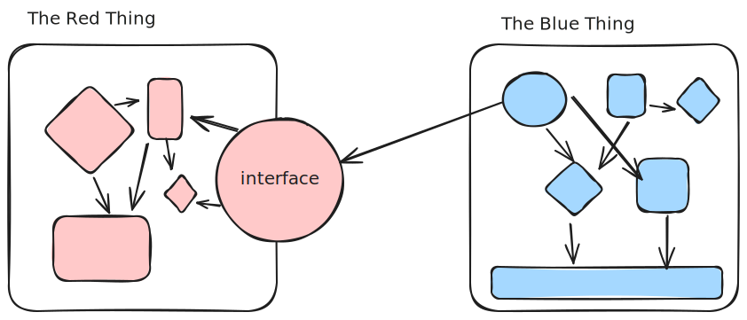

+++
title = "Why did we choose a monorepo?"
slug = "monorepo-1-why-choose-a-monorepo"
date = "2025-01-06"
category = "ci-cd"

[extra]
author = "Bob Gregory"

[taxonomies]
tags = ["monorepo", "ci-cd"]
+++


# MonoRepo Experience Report: Part 1


The first thing that made me nervous when I joined Carbon Re was The MonoRepo. I'd heard of monorepos, of course, but I'd never implemented them in practice. For clarity, by "monorepo" I mean "a single git repository containing all the code for an organisation". 

<!-- more -->
The term often gets abused to mean "a frontend and backend in the same repo", so you'll see people on Reddit talking about their "monorepos",  plural, which is a contradiction in terms.
By "all code" I mean _all_ the code: Terraform, Javascript, Python, Jupyter notebooks, some Golang that we cloned from an upstream repo, some bits of Java - all of it in one place, with a single CI/CD pipeline.

I want to talk a bit about how we've evolved our monorepo solution over time, and what the challenges and benefits are for us as an organisation.



## In this post

- Why did we choose a monorepo approach at Carbon Re?
- What are the benefits and challenges of a monorepo?

## Next up

- How did we start out building a monorepo, and what were the results?



## Why have I always preferred individual repositories?

The first rule of package management is this: 

> Things that change together, ship together.

When we're designing a system, we want to find boundaries in our codebase where the things _inside_ the boundary are cohesive - they work together - and the things _outside_ the boundary are _loosely coupled_. We want to divide our code up into chunks, where each chunk exposes some set of behaviours that we can easily consume without knowing the internal details. This fundamental idea characterises classes in OO, modules in functional languages, microservices, and so much more.



In this terrible diagram, we have two software components - they might be libraries, they might be classes, they might be web services. Internally, they have a high degree of coupling, but the interactions between them are constrained to a simplified interface.

The most common failure mode for software projects is the Big Ball of Mud, where the relationships between parts are unclear, and we end up with coupling across the codebase. Over time that makes it harder to change things without causing unanticipated problems elsewhere.

It is _usual_ to put chunks into separate repositories, whether those chunks are libraries (eg, an npm package used by other parts of your app), or services (eg an API, or a front-end application). When any code inside the repository changes, the whole repository has to be deployed, because the repository comprises an atomic unit of functionality. The things inside that unit are cohesive, and exhibit strong coupling.

If we have a repository for our backend API, and a repository for a logging module, each of those components has a distinct _version_. The git hash for a commit uniquely identifies a version of the codebase that we could deploy. The build process for those repositories produces a single artifact - a package for our logging library, and a zip file or docker image for our backend API. That artifactcan be versioned.

Simple. If you change code in the logging library, you can _not_ break the backend API unless you also update the API to pull a new version of the package. Changes are well-isolated.

## Why did Carbon Re adopt a monorepo?

I was not the first engineer to join the company. By the time I arrived, we already had a fullstack engineer (ex-Googler), and a lead machine-learning engineer (former Google, Facebook, miscellaneous). They were both accustomed to a monorepo environment, and insisted that it was the correct choice.

The major argument was "having a single repository makes it easy to facilitate change across the system". This is - to be clear - the exact opposite rationale from single-artifact repositories where we want to _prevent_ change across the whole system.

What's the trade-off? Well, consider the logging package and API. When I worked at Cazoo, I wrote a [logging module](https://www.npmjs.com/package/@cazoo/logger) in Typescript that encapsulated a standard schema for structured logs. That made it easy for teams to integrate with our logging infrastructure. The challenge was that _updating_ the module became extremely hard. By the time I left, there were dozens of services using the logger, at different versions. I wanted teams to upgrade, to get bug fixes or newer ways of extending behaviour, but it wasn't a priority for them to take on breaking changes.

At Carbon Re, if I want to change the way we record telemetry, I can raise a single pull request that will atomically update every part of our system.


## Footguns ahead!

You may not _want_ to update every part of your system at the same time.

Later in the series I'll be talking about how we manage changes over time, so that we don't break during a deployment, or when making large-scale refactors.


The second argument was "having a single repository makes it easier to share code". Again, this is the opposite of the choice I would usually make. I believe(d) it is _better_ to duplicate code until you have seen the same code work in multiple contexts, and _then_ extract something that can be shared. This avoids premature generalisation, and saves us from working with crappy interfaces that lead to a Ball of Mud.

For example, let's imagine that we want to read data from a database, and so we write ourselves a class.

```python
class DataFetcher:

   def get_users(self, company_id: int) -> Iterable[User]:
       ...
```

Well and good. A little while later, someone elsewhere in the codebase _also_ needs to fetch `User`s from the database, and so they decide to re-use the same class, except that they don't want to query by company_id, they want to query by username prefix.

```python
class DataFetcher:

   def get_users(self, company_id: int=None, username_prefix=None) -> Iterable[User]:
       ...
```

Yeesh, add a third use-case, and a fourth and we will very quickly make a mess of our interface. Instead it might be better for both parts of the system to just copy-paste the Fetcher and change it to suit their needs. Once we've seen it copy-pasted a few times, and understand how the use-cases will be different, we can _refactor_ to remove the duplication, leading to a better design.

So why did my colleagues think otherwise?

In machine-learning systems, it's very common to have code that we want to re-use across multiple components. For example, we might want to apply the same cleaning function across multiple models, or to use a standard set of visualisations to inspect the performance of our predictor. Moreover, _ML engineers are not software engineers_, and don't often have a SWE background. They're more accustomed to hacking at scripts than building distributed systems and thinking about version management. This isn't a criticism - I've spent 25 years thinking about how to find and maintain boundaries in systems, but I can't tell you how a [Kalman Filter](https://en.wikipedia.org/wiki/Kalman_filter) works.

Keeping the code in a single repository facilitates sharing of common functionality, without imposing a bunch of bewildering package management stuff that the ML team don't want to consider.


## TL;DR

There are two _entirely_ different schools of thought with respect to multi/mono repo approaches.

### Multi-Repo

- Introduce a hard _change boundary_ to reduce coupling between components.
- Each repo contains a single _versioned_ set of artifacts.
- Each repo has a separate build and deployment pipeline.

### Mono-Repo

- Favour system-wide refactoring and easy code re-use.
- The repo contains _all_ the code across the org.
- The repo necessarily has a single set of pipelines for all components.



## What are the challenges inherent in a monorepo?

I was skeptical, because while [Google](https://qeunit.com/blog/how-google-does-monorepo/) and [Facebook](https://blog.3d-logic.com/2024/09/02/what-it-is-like-to-work-in-metas-facebooks-monorepo/) might be in love with their monorepos, they can afford to employ entire teams of engineers just to manage their VCS and build systems. My major concern was that the tooling and ci/cd setup would be significantly more complex in a mono-repo world. I was right, but with time and effort, we've managed to build a continuous deployment pipeline that works across our entire system.

The code-coupling _is_ a problem, that we still haven't solved. For example, we have a configuration system for our machine learning models, that is essentially a dictionary.

```python
models = {
   "oxygen_model": oxygenmodel(
      runs_every=dt.timedelta(minutes=15),
      data_loader=load_cleaned_dataset(...)
   )
   "temperature_model": tempmodel(
      runs_every=dt.timedelta(minutes=15),
      data_loader=load_cleaned_dataset(...)
   )
}
```

I have a Lambda function component that's responsible for scheduling the models to run at the right time. The simplest implementation for that is to read the models dictionary, extract the `runs_every` value, and use that to derive a schedule, *but* the models config also has references to data loaders and to model objects themselves. The model objects might depend on [SciPy](https://scipy.org/) or [NumPy](https://numpy.org/) or a bunch of weird visualisation libs. This means that the lambda function ends up containing those dependencies, bloating its size from a few kilobytes to almost a gigabyte. We could _separate_ the config for scheduling from the implementation, but in a monorepo, it's _really easy_ for people to re-introduce those dependencies without realising it. If the scheduler component were in a separate repository from the models, we would be forced to find some other, less usable, way of declaring our scheduling requirements.
