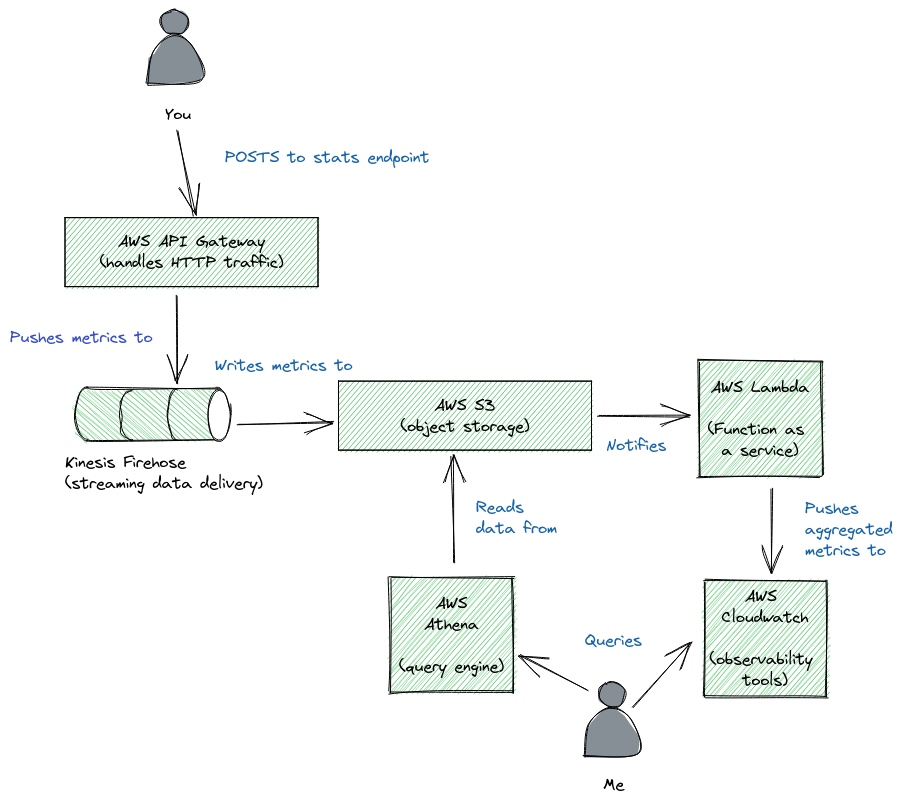
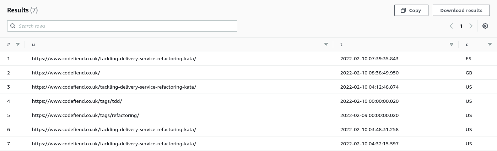

+++
title = "Building a serverless web analytics solution"
slug = "serverless-web-analytics"
date = "2022-02-10"
category = "serverless"

[extra]
author = "Bob Gregory"

[taxonomies]
tags = ["stats", "thinking-serverless", "meta"]
+++

In this short blog series, we build our own web analytics solution from scratch using serverless technologies, just because we can. 

<!-- more -->

## Why do I want stats anyway?

One of the perks of writing about stuff on the internet is that you can see when people are actually reading it. Without that positive reinforcement, you may as well be scrawling graffiti on your local bus stop; "bob wos ere 2022", "look upon my tag ye mighty and tremble".

In the olden days, I'd get that data by scraping the access logs on the server, but this site is hosted on Cloudflare Pages, so there are no servers to scrape. I could *pay* for access logs, but that takes the cost of this blog from £0 to roughly £200 a year, which seems like a bit of a step up just so I can see the Googlebot reading my thoughts on TDD katas.

I could install Google Analytics, but I personally hate cookies and tracking scripts. There are privacy conscious alternatives [^1], but - again - I'd have to open my wallet, and add a load of third party scripts to the page.

No, that'll never do. We're going to have to build our own[^2].


## Goals

I want a web stats solution that is

- [ ] Anonymous: I really don't want to deal with cookies or GDPR considerations.
- [ ] Cheap: this blog is currently _free_ to run, and I'd rather not spend much more than that.
- [ ] Simple: whatever I deploy will need to be built and maintained by me when I'm not working, cooking, or bellowing at my children.


Here's what I've come up with:

Let's take each piece at a time.

### API Gateway

I've [added a script](https://github.com/bobthemighty/codefiend-site/blob/9b6091a68d793cb6ab973520825a707a0adeb249/templates/index.html#L107) at the bottom of each page that captures the current url, the referrer, and the approximate size of the screen and sends that to a stats endpoint.

The stats endpoint is an AWS API Gateway, proxied through the Cloudflare site that hosts this page. The gateway handles a few things for me.

* It validates the incoming request body.
* It throttles requests, so I don't get flooded with malicious traffic.
* It enriches the incoming request with the user's user-agent and geo-ip country.
* It integrates directly with Kinesis firehose.

### Firehose

Firehose is a tool for shifting data out of Kinesis (Amazon's Kafka equivalent) and into some data store.

Setting up the Firehose integration was finicky, and I'll write about that separately. It would have been much easier to use a lambda and write into S3 that way, but using a direct put to Firehose should be cheaper and more reliable.

Firehose delivery streams are intended for high write-throughput use-cases like streaming analytics. In our case it's massive overkill, but attractive for a couple of reasons.

* Firehose will _batch_ writes. If I suddenly receive 5000 hits in a minute, we'll write _one_ file to S3 with all 5000 hits. That reduces the number of `s3:PutObject` calls and makes our costs more predictable.
* Firehose has a built-in integration with S3, which means I don't need to write any code to reliably store my hits.

### S3

S3 is Amazon's object storage solution. When the stats are written, they get dumped into an object prefix called `/inbound`. Because Firehose batches the writes, I get (at most) one file every 15 minutes. 

I've set up a lifecycle policy on the bucket so that these files are automatically deleted after 14 days. This keeps storage costs low.

### Athena

Athena is a serverless query engine that can run SQL queries against S3 objects. It's cheap to run and really powerful. I can dump a load of JSON into a bucket and then run aggregated queries against it for a few pennies.

Athena works best with a few large files, and we're creating many small files, so we need to perform periodic compaction for best results.

### Lambda

Lambda is Amazon's "Function as a service" offering, and is my go to tool for cloud compute.

We use it for two main use-cases in this setup.

* Whenever a file is written to the `inbound` prefix in S3, we load the file, and write Cloudwatch metrics. This gives us pretty graphs showing hit counts over time. I can also use this to detect weird bursts in traffic.

* Periodically, we run a script that copies all the data out of `/inbound` into a weekly snapshot. These snapshot files are stored under a `/snapshots` prefix and are automatically deleted after a year. This means I should only have 52 files to deal with if I want to query over a longer period.

### Cloudwatch

Lastly, cloudwatch is amazon's logging and metrics platform. It's surprisingly expensive if you're not careful, but here I'm using embedded metrics format, which is a much cheaper way to write stats.

Each of my log groups has a 1 day retention period so I don't end up paying for gigabytes of useless log files. Cloudwatch performs automatic metric downsampling, so that older data is cheaper to store.

## How does it work?

So far so good! How much will it cost us?

### API Gateway
I've throttled the endpoint to 10k requests a day, so we should have at most 300k requests a month. There's also an OPTIONS method for CORS, but we can cache that in Cloudflare since it's static.  $0.33 

### Firehose

Our throttle limits requests to 1 per sec at steady state, so we should write at most 1 request per sec to kinesis *$0.39*

### S3

Since we're batching writes, we'll make up to 4 writes an hour to S3, for a total of 2880 per month. We'll store less than 1Gb of data in total  *$0.04* 

### Lambda
We'll run 1 lambda for each new file in inbound, plus some more for compaction, so let's say 2 per file for a total of 6000 invocations. Each invocation should run for under a sec and use less than a Gb of memory. For that little usage, AWS won't bother charging us.  *$0.00* 

### Cloudwatch

Cloudwatch likewise has an "always free" plan that more than covers our needs. *$0.00*

I've probably forgotten something, and we'll have to pay a tiny amount for each Athena query we run, but we can see that this stack should cost us less than $0.80 a month in total *even if* we get 10,000 visits a day, which seems improbable.


## Goals

- [x] Anonymous: no cookies or 3rd party scripts.
- [x] Cheap: I can spare 80 cents, I guess.
- [x] Simple: There's quite a few pieces involved, but each piece is very simple to manage.


I often hear from engineers that serverless is an expensive way to build software, but I think this shows that with care, you can build something _really_ cheap and robust out of serverless components.

[^1]: Both [Plausible.io](https://plausible.io) and [GetInsights.io](https://getinsights.io) were pretty tempting, but less fun than writing my own.

[^2]: As an architect, I'm compelled to advise you _not_ to build your own stats system unless, like me, you're doing it for kicks and to save pennies. It definitely cost me more than $200 of software engineering time.
